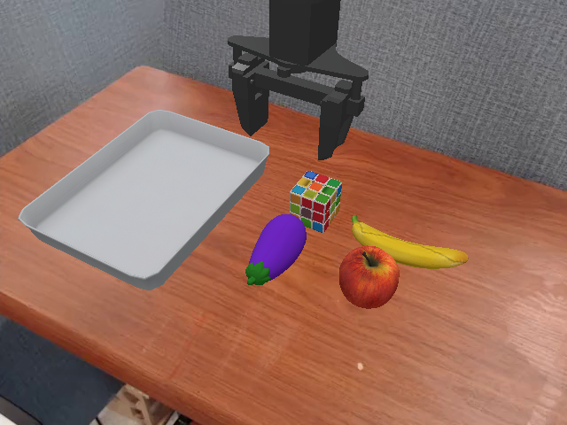

# Enhanced SimplerEnv

This repository is an **enhanced version of SimplerEnv**, designed to evaluate policy capabilities in:

- 🔍 **Visual Grounding**
- 📐 **Spatial Understanding**
- ❓ **Disambiguation**
- 🧠 **Semantic Reasoning**
- 🕒 **Long-Horizon Manipulation**

## Getting Started

Follow the [Installation](#installation) section to install the minimal requirements for our environments. Then you can run the following minimal inference script with interactive
python. The scripts creates prepackaged environments for our `visual matching` evaluation setup.

```python
import simpler_env
from simpler_env.utils.env.observation_utils import get_image_from_maniskill2_obs_dict

env = simpler_env.make('google_robot_pick_coke_can')
obs, reset_info = env.reset()
instruction = env.get_language_instruction()
print("Reset info", reset_info)
print("Instruction", instruction)

done, truncated = False, False
while not (done or truncated):
    # action[:3]: delta xyz; action[3:6]: delta rotation in axis-angle representation;
    # action[6:7]: gripper (the meaning of open / close depends on robot URDF)
    image = get_image_from_maniskill2_obs_dict(env, obs)
    action = env.action_space.sample()  # replace this with your policy inference
    obs, reward, done, truncated, info = env.step(
        action)  # for long horizon tasks, you can call env.advance_to_next_subtask() to advance to the next subtask; the environment might also autoadvance if env._elapsed_steps is larger than a threshold
    new_instruction = env.get_language_instruction()
    if new_instruction != instruction:
        # for long horizon tasks, we get a new instruction when robot proceeds to the next subtask
        instruction = new_instruction
        print("New Instruction", instruction)

episode_stats = info.get('episode_stats', {})
print("Episode stats", episode_stats)
```

Additionally, you can play with our environments in an interactive manner
through [`ManiSkill2_real2sim/mani_skill2_real2sim/examples/demo_manual_control_custom_envs.py`](https://github.com/LostThinker/ManiSkill2_real2sim/blob/main/mani_skill2_real2sim/examples/demo_manual_control_custom_envs.py).
See the script for more details and commands.

## Installation

Create an anaconda environment:

```
conda create -n simpler_env python=3.10 (3.10 or 3.11)
conda activate simpler_env
```

Clone this repo:

```
git clone https://github.com/LostThinker/SimplerEnv-dev --recurse-submodules
```

Install numpy<2.0 (otherwise errors in IK might occur in pinocchio):

```
pip install numpy==1.24.4
```

Install ManiSkill2 real-to-sim environments and their dependencies:

```
cd {this_repo}/ManiSkill2_real2sim
pip install -e .
```

Install this package:

```
cd {this_repo}
pip install -e .
```

## Current Environments

To get a list of all available environments, run:

```
import simpler_env
print(simpler_env.ENVIRONMENTS)
```

In extended environments, a task ID typically corresponds to multiple scene setups. You can use the following code to check how many episodes it contains and inspect observations:

```
import simpler_env
import matplotlib.pyplot as plt

env = simpler_env.make("widowx_seen_obj_on_seen_tg")
total_episode_num = getattr(env, "total_episode_num", 1)
print(total_episode_num)

for i in range(total_episode_num):
    env_reset_options = {"obj_init_options": {"episode_id": i}}
    obs, reset_info = env.reset(options=env_reset_options)
    image = get_image_from_maniskill2_obs_dict(env, obs)
    plt.imshow(image)
    plt.show()
```

### Original Environments

| Task Name                           | ManiSkill2 Env Name                          | Image (Visual Matching)                                                                                                |
|-------------------------------------|----------------------------------------------|------------------------------------------------------------------------------------------------------------------------|
| google_robot_pick_coke_can          | GraspSingleOpenedCokeCanInScene-v0           |          |
| google_robot_pick_object            | GraspSingleRandomObjectInScene-v0            |                |
| google_robot_move_near              | MoveNearGoogleBakedTexInScene-v1             |         |
| google_robot_open_drawer            | OpenDrawerCustomInScene-v0                   |       |
| google_robot_close_drawer           | CloseDrawerCustomInScene-v0                  |      |
| google_robot_place_in_closed_drawer | PlaceIntoClosedDrawerCustomInScene-v0        |    |
| widowx_spoon_on_towel               | PutSpoonOnTableClothInScene-v0               |          |
| widowx_carrot_on_plate              | PutCarrotOnPlateInScene-v0                   |         |
| widowx_stack_cube                   | StackGreenCubeOnYellowCubeBakedTexInScene-v0 |              |
| widowx_put_eggplant_in_basket       | PutEggplantInBasketScene-v0                  |  |

### Visual Grounding

| Task Name                           | ManiSkill2 Env Name           | Image (Visual Matching)                                                                                      |
|-------------------------------------|-------------------------------|--------------------------------------------------------------------------------------------------------------|
| widowx_seen_obj_on_seen_tg          | PutSeenObjOnSeenTg-v0         |           |
| widowx_unseen_obj_on_seen_tg        | PutUnseenObjOnSeenTg-v0       |         |
| widowx_unseen_obj_on_unseen_tg      | PutUnseenObjOnUnseenTg-v0     |       |
| widowx_unseen_obj_on_unseen_tg_hard | PutUnseenObjOnUnseenTgHard-v0 |  |

### Spatial Understanding

| Task Name              | ManiSkill2 Env Name        | Image (Visual Matching)                                                                         |
|------------------------|----------------------------|-------------------------------------------------------------------------------------------------|
| widowx_move_near_tg    | MoveObjNearTarget-v0       |     |
| widowx_move_left_tg    | MoveObjToLeftOfTarget-v0   |     |
| widowx_move_right_tg   | MoveObjToRightOfTarget-v0  |    |
| widowx_move_front_tg   | MoveObjInFrontOfTarget-v0  |    |
| widowx_move_behind_tg  | MoveObjBehindTarget-v0     |   |
| widowx_move_away_tg    | MoveObjAwayFromTarget-v0   |     |
| widowx_move_between_tg | MoveObjBetweenTargets-v0   |  |
| widowx_put_sw_obj_tg   | PutObjSomeWhereOnTarget-v0 |    |

### Disambiguation

| Task Name               | ManiSkill2 Env Name    | Image (Visual Matching)                                                                          |
|-------------------------|------------------------|--------------------------------------------------------------------------------------------------|
| widowx_put_ambig_obj_tg | PutAmbigObjOnTarget-v0 |  |
| widowx_put_obj_ambig_tg | PutObjOnAmbigTarget-v0 |  |

### Semantic reasoning

| Task Name                  | ManiSkill2 Env Name       | Image (Visual Matching)                                                                             |
|----------------------------|---------------------------|-----------------------------------------------------------------------------------------------------|
| widowx_put_vege_tg         | PutVegeObjOnTarget-v0     |          |
| widowx_put_toy_tg          | PutToyObjOnTarget-v0      |           |
| widowx_put_fruit_tg        | PutFruitObjOnTarget-v0    |         |
| widowx_put_obj_tg_semantic | PutObjOnTargetSemantic-v0 |  |

### Long-horizon

| Task Name                   | ManiSkill2 Env Name           | Image (Visual Matching)                                                                              |
|-----------------------------|-------------------------------|------------------------------------------------------------------------------------------------------|
| widowx_put_all_in_tray      | PutAllInTrayMulti-v0          |       |
| widowx_put_toy_in_tray      | PutToyInTrayMulti-v0          |       |
| widowx_put_fruit_in_tray    | PutFruitInTrayMulti-v0        |     |
| widowx_put_vege_in_tray     | PutVegeInTrayMulti-v0         |      |
| widowx_put_in_tray_categ    | PutObjInTrayCategorize-v0     |     |
| widowx_put_on_multi_tg      | PutObjectOnTargetMulti-v0     |       |
| widowx_put_on_multi_tg_occu | PutObjectOnOccuTargetMulti-v0 |  |

## Asset generation and import

All new assets are generated using [Hunyuan3D](https://3d.hunyuan.tencent.com/).
see [this guide](https://github.com/LostThinker/SimplerEnv-dev/blob/main/README_ASSET.md) to learn how to add assets.


